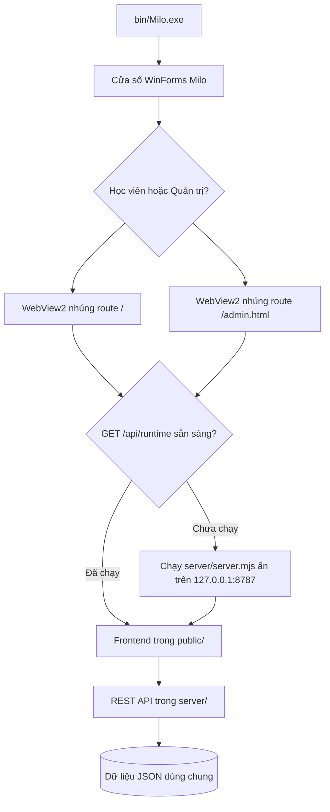

# Kiến Trúc Hệ Thống

**Dự án:** Milo English Adventure V60.24.4  
**Kiến trúc:** một Windows native app + local Node.js server + WebView2 nhúng

## 1. Artifact và giao diện khởi động

Artifact Windows chuẩn duy nhất là `bin/Milo.exe`, build từ `windows-launcher-src/milo-webview-host/MiloDesktopHost.csproj`.

- `bin/Milo.exe` mở một cửa sổ WinForms riêng, không mở trình duyệt bên ngoài.
- Thanh đầu cửa sổ có hai nút: **Học viên** (route `/`) và **Quản trị** (route `/admin.html`).
- `bin/Milo.exe --admin` chỉ là lối vào trực tiếp cho quản trị; không có EXE quản trị thứ hai.
- WebView2 chỉ là engine được nhúng trong cửa sổ Milo, không mở Edge/Chrome app-mode.

`safe-portable-launcher.go` chỉ là mã tương thích để chuyển tiếp về launcher chuẩn. Artifact phát hành duy nhất là `bin/Milo.exe`; không có mã mở trình duyệt ngoài ứng dụng.

## 2. Luồng thực thi



Launcher giữ tiến trình server trong suốt phiên app và dừng server do nó quản lý sau khi cửa sổ Milo đóng.

## 3. Cây runtime chuẩn

```text
root/
├── bin/
│   └── Milo.exe
├── server/
│   ├── server.mjs
│   ├── commerce-server.mjs
│   ├── paths.mjs
│   ├── tutor-prompt.mjs
│   └── tutor-response.mjs
├── public/
│   ├── index.html
│   ├── lesson.html
│   └── admin.html
├── windows-launcher-src/
│   └── milo-webview-host/
│       ├── MiloDesktopHost.csproj
│       └── Program.cs
├── content/
├── assets/
├── src/
├── .env.example
└── package.json
```

Các bài kiểm thử chạy trực tiếp trên cây này. Không cần bản sao runtime trong thư mục phát hành riêng.

## 4. Các luồng nghiệp vụ chính

### Server backend

`server/server.mjs` lắng nghe tại `127.0.0.1:8787`, phục vụ static files từ `public/`, đọc cấu hình server-side và chuyển các API tài khoản, thương mại, tiến độ và trợ lý học tập sang module có trách nhiệm tương ứng.

### Đăng nhập và phân quyền VIP

- AI Plus mở cho tài khoản học sinh đã đăng nhập.
- VIP PRO MAX được xác thực ở server; sửa LocalStorage hoặc DOM không thể tự cấp quyền.
- Phụ huynh tạo đơn, quản trị viên duyệt tại `admin.html`, sau đó server cập nhật quyền trong cơ sở dữ liệu.

### Chương trình học

- Mỗi lớp 2–5 có 12 Unit.
- Milestone cấp độ là `[4, 8, 12, 16, 20, 24, 28, 32, 36, 40, 45, 50]`.
- Hoàn thành Unit 12 đạt Lv.50.

## 5. Dữ liệu và nâng cấp

Dữ liệu tài khoản, đơn hàng và tiến độ được lưu ngoài mã phiên bản theo đường dẫn do `server/paths.mjs` quản lý. Việc thay cây ứng dụng không được xóa dữ liệu dùng chung này.
